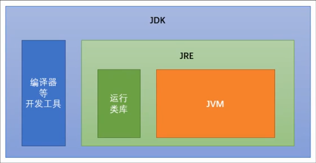
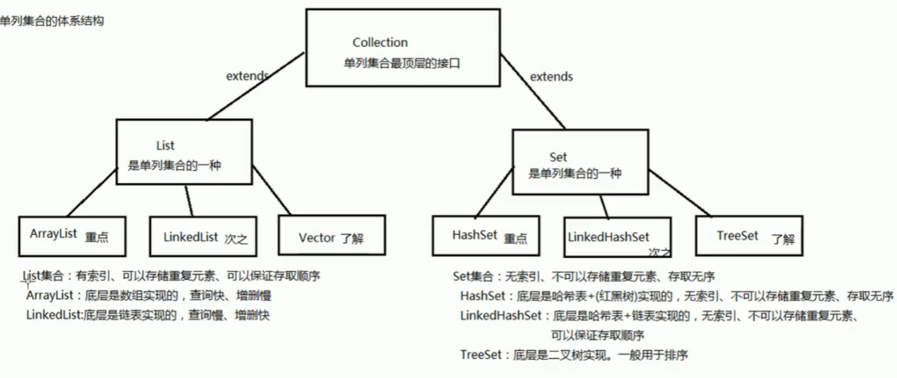

## 前言
Java语言是美国Sun公司（stanford University Network）在1995年推出的高级编程语言。2009年Oracle甲骨文公司收购Sun公司，并于2011年发布java7版本

### JVM、JRE、JDK
+ JVM（java Virtual Machine）：Java编写的软件可以运行在任何操作系统上，这个特性称为Java语言的跨平台特性。该特性是由JVM实现的，我们编写的程序运行在JVM上，而JVM运行在操作系统上。  
+ JRE（Java Runtime Environment）:是Java程序的运行时环境，包括JVM和运行时所需的核心类库。
+ JDK（Java Development Kit）:是Java程序开发工具包，包括JRE和开发人员使用的工具

  

    编译java程序：javac xxx.java
    运行程序：java xxx
    java命令行工具：jShell 

### 常量分类

+ 字符串常量：`"hello world"`
+ 整数常量：`200`
+ 浮点数常量：`1.23`
+ 字符常量：`'a'`，注意：单引号括住的单字符，有且只有一个字符，不能为空
+ 布尔常量：`true`、`false`
+ 空常量：null，注意：空常量不能用来打印输出，如：System.out.println(null) //会报错

### 数据类型 

1. 基本数据类型：
+ 整数型： byle（1字节）、short（2字节）、int（4字节 默认）、long（8字节）
+ 浮动型： float（4字节）、double（8字节 默认）
+ 字符型： char（2字节）
+ 布尔型： boolean（1字节）  
注意：  
  (1) 字符串不是基本类型，而是引用类型。   
  (2) 浮动型可能只是一个近似值，并非精确的值。  
  (3) 浮点数默认为double类型，若要使用float类型，需要加后缀F  
  (4) 整数默认为int类型，若要使用long类型，需要加后缀L，推荐大写字母后缀。

### 使用变量的注意事项

1. 如果创建多个变量，那么变量之间的名称不能重复
2. 对于float和long类型来说，字母后缀F和L不要丢掉
3. 如果使用byte或者short类型的变量，右侧数值不要超过左侧类型的范围
4. 变量得初始化后才能使用
5. 变量的使用不能超出作用域范围，如:

```java
{
  int num1 = 100;
}
System.out.println(num1); // 会出错
```

### 类型转换

自动类型转换（隐式）
1. 特点：代码不需要进行特殊处理，自动完成
2. 规则：数据范围从小到大  
注意：范围与字节不一定相关，比如 float num = 100L; long -> float  

强制类型转换 
1. 特点：代码需要进行特殊格式处理，不能自动完成    
注意：
1. 强制类型转换一般不推荐使用，因为有可能发生精度损失，数据溢出。
2. byte/short/char这三种类型都可以发生数学运算，运算时会被提升成为int类型，然后再计算。
3. boolean类型不能发生数据类型转换。
4. 对于String类型，加号代表字符串连接操作。
5. 对于byte/short/char三种类型来说，如果右侧赋值的数值没有超过范围，那么javac编译器将会自动隐式地为我们补上(byte)(short)(char)。如果超过左侧范围，会报错

```java
int num = (int) 100L;
char c = 'A';
System.out.println(c + 1); // 66， '1' + 0 = 49

byte n1 = 40;
byte n2 = 50;
int result = n1 + n2;
byte result2 = (byte)(n1 + n2);

String str = "Java";
System.out.println(str + 10 + 20); //Java1020 
```

编译器的常量优化：在给变量进行赋值的时候，如果右侧表达式全是常量，那么编译器javac会直接将若干个常量表达式计算得到结果。

```java
short a = 5;
short b = 8;
short result = a + b; //会报错

short result = 5 + 8; // 相当于 short result = 13;
```
### 方法

注意事项：
1. 方法定义无所谓顺序。
2. 方法的定义不能产生嵌套包含关系。
3. 不能再一个方法的内部定义另一个方法。

### IDEA常用快捷键

|快捷键|功能|
|:--|:--|
|Alt+Enter|导入包自动修正代码|
|Ctrl+Y|删除光标所在行|
|Ctrl+D|复制光标所在行的内容，插入光标位置下面|
|Ctrl+Alt+L|格式化代码|
|Ctrl+/|单行注释，再按取消注释|
|Ctrl+Shift+/|选中代码注释，多行注释，再按取消注释|
|Alt+Ins|自动生成代码，toString，get，set等方法|
|Alt+Shift+上下箭头|移动当前代码行|

### 方法重载

方法名称一样，参数列表不一样

方法重载与下列因素无关：
1. 与参数的名称无关。
2. 与方法的返回值类型无关。

```java
public class HelloWorld {
    public static void main(String[] args) {
        System.out.println(sum(1, 2));
        System.out.println(sum(1, 2, 3));
        System.out.println(sum(1.3,2.1));
    }
    public static int sum(int a, int b) {
        return a + b;
    }
    public static  int sum(int a, int b, int c) {
        return  a + b + c;
    }
    public  static double sum(double a, double b) {
        return a + b;
    }
}
```

### 数组

数组初始化

注意：
+ 静态初始化虽然没有指定长度，但仍会自动推算得到长度
+ 静态初始化的省略模式，不能拆分为两个步骤
+ 直接打印数组名称，得到的是该数组的内存地址哈希值
+ 动态初始化数组，其中的元素会自动拥有一个默认值：
  + 整数类型，默认为0
  + 浮点数类型，默认为0.0
  + 布尔类型，默认为false
  + 字符类型，默认为\u0000
  + 引用类型，默认为null
+ 静态初始化起始也有默认值，只不过会被具体的内容替代掉
```java
// 动态初始化
int[] arr1 = new int[10]; // 动态初始化（指定长度）
// 静态初始化标准模式
int[] arr2 = new int[] {3, 1, 2, 4}; // 静态初始化（指定内容）
// 静态初始化省略模式
int[] arr3 = {3, 1, 2, 4}

// 静态初始化的省略模式，不能拆分为两个步骤
// int[] arr4;
// arr4 = {3, 1, 3};  // 会报错

int len = arr2.length; // 获取数组的长度
```

### ArrayList<E> 

+ 数组的长度不可发生改变
+ ArrayList集合的长度可以随意变化
+ 尖括号代表泛型（即集合中的所有元素都是同一类型）
+ 泛型只能是引用类型，不能是基本类型
+ 直接空的ArrayList打印不是地址值，而是[]

```java
public class Domo {
  public static void main(String[] args) {
    ArrayList<string> list = new ArrayList<>();
    System.out.println(list); // []
    list.add("Tom"); // add向集合中添加元素
    list.add("Jone");
    System.out.println(list); // [Tom, Jone]

    System.out.println(list.get(0)); // get获取第一个元素

    list.remove(1); // 删除元素

    list.size(); // 获取集合的长度
  }
}
```

如果希望向集合ArrayList当中存储基本数据类型，必须使用基本类型对应的“包装类”

|基本类型|包装类|
|--:|--:|
|byte|Byte|
|short|Short|
|int|Integer|
|long|Long|
|float|Float|
|double|Double|
|char|Character|
|boolean|Boolean|

```java
ArrayList<Interger> list = new ArrayList<>();
list.add(21);
```
### Java内存划分

1. 栈 (Stack)：存放的都是方法中的局部变量，一旦超出作用域，立刻从栈内存中消失。方法的运行一定要在栈中

2. 堆（Heap）：凡是new出来的东西，都在堆中

3. 方法区（Method Area）：存储class相关信息，包括方法的信息

4. 本地方法栈（Native Method Stack）：与操作系统相关

5. 寄存器（pc Register）：与CPU相关

### 对象

```java
public class Phone {
  String brand;
}

Phone one = new Phone()
System.out.println(one.brand);
```

### 局部变量与成员变量
+ 定义的位置不一样
  - 局部变量：在方法的内部
  - 成员变量：在方法的外部，直接写在类当中

+ 作用范围不一样
  - 局部变量：只有方法当中才可以使用。
  - 成员变量：整个类都可用

+ 默认值不一样
  - 局部变量：没有默认值，必须进行初始化
  - 成员变量：如果没有赋值，会有默认值，规则跟数组一样

+ 内存的位置不一样
  - 局部变量：位于栈内存
  - 成员变量：位于堆内存

+ 生命周期不一样
  - 局部变量：随着方法进栈而诞生，随着方法出栈而消失
  - 成员变量：随着对象创建而诞生，随着对象被垃圾回收而消失

## 面向对象

三大特性：封装、继承、多态

封装性在Java中的体现：
1. 方法也是一种封装
2. private


一个标准的类通常要拥有下面四个组成部分：
1. 所有成员变量都要用private关键字修饰
2. 为每一个成员变量编写一对儿Getter/Setter方法
3. 编写一个无参数的构造方法
4. 编写一个全参数的构造方法

### 构造方法 

注意事项：
1. 构造方法的名称必须与类名完全一样
2. 构造方法不要写返回值类型，连void都写
3. 构造方法不能return一个具体的返回值
4. 如果没有编写任何构造方法，编译器会默认赠送一个没有参数，方法体啥也不做的构造方法
6. 一旦编写了至少一个构造方法，那么编译器不再赠送
7. 构造方法可以重载

```java
public class Student {
  private String name;
  private int age;

  public Student() {
    System.out.println("构造方法执行啦！");
  }

  public Student(String name, int age) {
    this.name = name;
    this.age = age;
  }

  // Getter
  public String getName() {
    return name;
  }

  // setter
  public void setName(name) {
    this.name = name;
  }
}

// 调用构造方法
Student stu = new Student("Tom", 29);
```

### static 

+ 如果一个成员变量或者方法使用了static关键字，那么这个变量不再属于对象自己，而是属于所在的类。多个对象共享同一份数据。
+ 推荐：类名称.静态方法，类名称.静态变量
+ 本类当中的静态方法，可以省略类名称
+ 静态不能直接访问非静态：原因是内存当中先有静态内容，后才有非静态
+ 静态方法中不能使用this

静态代码块
特点：当第一次用到本类时，静态代码块执行唯一的一次
典型用途：用来一次性地对静态成员变量进行赋值
```java
public class Person {
  static {
    System.out.println("静态代码块执行");
  }
}
```

### 继承

+ 重写（Override）：方法名称一样，参数列表也一样。
+ 重载（Overload）：方法的名称一样，参数列表不一样。
+ @Override ：放在方法前面，用来检测是否是有效的正确覆盖重写
+ 子类方法的返回值必须【小于等于】父类方法的返回值范围
+ 子类方法的权限必须【大于等于】父类方法的权限修饰符（public > protected > + (default) > private）
+ 子类构造方法当中有一个默认隐含的"super()"调用，所以一定是先调用父类构造，后执行子类构造。
+ 只有在子类构造函数中才能调用父类构造函数，而且必须是子类构造方法的第一个语句
+ this(...)调用也必须是构造方法的第一个语句，唯一一个
+ super和this两种构造不能同时使用

```java
public class Student extends Teacher {

  public Student() {
    // super(); // 如果没写会默认调用父类的构造方法
    // super(12); // 调用父类重载构造
    this("Tom"); //调用本类的构造方法 
  }
  public Student(String name) {
    
  }
  @Override
  public void show() {
    int num = super.num; // 调用父类的num 
  }
}
```

Java语言的3个特点：
1. Java语言是单继承的，直接父类只能有一个
2. Java语言可以多级继承，即父亲也有父亲
3. 一个子类的直接父类是唯一的，但是一个父类可以拥有很多个子类
4. 子类必须覆盖重写抽象父类当中的所有的抽象方法，除非该子类也是抽象类
### 抽象类

+ 如果父类当中的方法不确定具体实现，那么这应该是一个抽象方法
+ 抽象方法所在的类必须是抽象类才行
+ 不能直接创建new抽象类
+ 必须有一个子类来继承抽象类
+ 抽象类不一定包含抽象方法

```java
public abstract class Animal {
  public abstract void eat();

}
public class Cat extends Animal{
  public void eat() {} // 覆盖重写抽象方法
}
```

### 接口

接口就是多个类公共规范
接口是一种引用数据类型，最重要的内容就是其中的：抽象方法

+ 如果是java7，接口包括的内容有：常量、抽象方法
+ 如果是java8，接口额外包含有：默认方法、静态方法
+ 如果是java9，还可以额外包含：私有方法

备注：
1. 接口中的默认方法，可以解决接口升级的问题
2. 不能通过接口实现类的对象来调用接口当中的静态方法
3. 接口中也可以定义“成员变量”，但是必须使用public static final来进行修饰。从效果看，这其实就是接口的【常量】
4. 接口中的常量必须进行赋值
5. 接口不能有静态代码块和构造方法
6. 一个类可以实现多个接口：implements MyInterfaceA, MyInterfaceB{}
7. 如果实现类所实现的多个接口，重复的抽象方法，只需覆盖重写一次即可
8. 如果实现类没有实现所有接口当中的所有抽象方法，那么实现类必须是一个抽象类
9. 如果实现类实现的多个接口中，存在重复的默认方法，那么实现类一定要对冲突的默认方法进行覆盖重写
10. 一个类直接父类当中的方法，与接口当中的默认方法产生冲突，优先用父类当中的方法
11. 接口可以多继承：public interfae MyInterface extends MyInterfaceA, MyInterfaceB {}
```java
/*
1. 接口当中的抽象方法，修饰符必须是两个固定的关键字：public abstract
2. 这两个关键字（public abstract），可以选择性地省略
 */
// 定义接口
public interface MyInterfaceAbstract {
    public static final int NUM = 10; // 一旦使用final修饰，说明不能改变
    public abstract void methodAbs1();
    // abstract void methodAbs3();
    // public void methodAbs4();
    // void methodAbs5(); // 这些都是抽象方法
    public default void methodDefault() {
      System.out.println("这是新添加的默认方法");
    }

    public static void methodStatic() {
      System.out.println("这是接口的静态方法");
    }
}

// 应用接口
public class MyInterfaceAbstractimpl implements MyInterfaceAbstract{
    @Override
    public void methodAbs1() {
      System.out.println("必须覆盖重写接口的所有抽象方法");
    }
}

public class MyInterfaceDefault03 {
    public static void main(String[] args) {
        MyInterfaceAbstractimpl a = new MyInterfaceAbstract();
        a.methodAbs1();
        a.methodDefault(); // 如果实现类当中没有，会向上找接口

        MyInterfaceAbstract.methodStatic();
        int a = MyInterfaceAbstract.num;
    }
}
```

### 多态

1. extends继承或则implements实现，是多态性的前提
2. 一句话可以体现多态：父类引用指向子类对象
3. 直接通过对象名称访问成员变量：看等号左边是谁，优先用谁，没有则向上找
4. 间接通过成员方法访问成员变量：看该方法属于谁，优先用谁，没有则向上找
5. 成员变量：编译看左边，运行还看左边
6. 成员方法：编译看左边，运行看右边

判断 本来的类型
animal instanceof Cat

### final

1. 当final关键字用来修饰一个类的时候，这个类就不能有任何的子类
2. 当final关键字用来修饰一个方法的时候，那个这个方法就是最终方法，不能被覆盖重写
3. 对于类、方法来说，abstract与final不能同时使用
4. final用来修饰一个局部变量，那么这个变量就不能进行更改
5. final用来修饰一个成员变量，这个变量也不可变，必须手动赋值，不会再给默认值（直接赋值，或者构造赋值都可以）
```java
public final class Myclass {

}
```

### 权限修饰符

public > protected > (default) > private  
同一个类 Y Y Y Y  
同一个包 Y Y Y N  
不同包子类 Y Y N N  
不同包非子类 Y N N N  

定义类：   
外部类：Y Y N N  
成员内部类： Y Y Y Y  
局部内部类：什么都不能写  

### 内部类

内部类：一个类包含另一个类

1. 成员内部类
2. 局部内部类（包含匿名内部类）: 方法里面定义的类

注意:
+ 内用外，随意访问；外用内，需要内部类对象。

```java
public class Body { // 外部类
  int num = 10;
  public class Heart { // 成员内部类
    int num = 20;
    public void beat() {
      int num = 30;
      System.out.println("心脏跳动");
      System.out.println(num); // 30
      System.out.println(this.num); // 20
      System.out.println(Body.this.num); // 10

    }
  }

  // 外部成员变量
  private String name;

  public void methodBody() {
    int num = 10; // Java 8+开始，只要局部变量事实不变，那么final关键字可以省略
    System.out.println("外部类的方法");
    new Heart().beat(); 
    class Inner { // 局部内部类
      public void methodInner() {
        System.out.println(num); // 访问所在方法的局部变量，那么这个变量必须是有效final
      }
    }
    Inner inner = new Inner();
    inner.methodInner();
  }
}

// 主入口
public class Main {
  public static void main(String[] args) {
    Body body = new Body();
    body.methodBody(); // 间接调用内部类Heart

    Body.Heart heart = new Body().new Heart(); // 直接调用
    heart.beat();
  }
}
```

匿名内部类：  
如果接口的实现类（或则父类的子类）只需使用唯一的一次，那么这种情况就可以省略掉该类的定义，而改为使用【匿名内部类】

```java
public interface MyInterface {
  void method();
}

// 主入口
public class Main {
  public static void main(String[] args) {
    MyInterface obj = new MyInterface() { // 匿名内部类实现
      @Override
      public void method() {
        System.out.println("匿名内部类");
      }
    }
    obj.method();
  }
}
```


## API

引用类型的一般使用步骤：
1. 导包：`import 包路径.类名称`
如果需要使用的目标类，和当前类处于同一个包下，则可以省略导包语句
只有java.lang下的内容不需要导包

2. 创建：`类名称 对象名 = new 类名称()`

3. 使用：`对象名.成员方法名()`

### Scanner

功能：实现键盘输入数据到程序当中

获取键盘输入的一个int数字：int num = sc.nextInt();
获取键盘输入的一个字符串：String str = sc.next();

从键盘中输入的都是字符串，nextInt() 只是把字符串转为int

```java
import java.util.Scanner;

public class Demo01 {
  public static void main(String[] args) {
    Scanner sc = new Scanner(System.in); // System.in：从键盘输入

    int num = sc.nextInt();
    System.out.println("输入的int数字是："+num);
  }
}
```

### Random

```java
import java.util.Random;

public class Demo02 {
  public static void main(String[] args) {
    Random r = new Random();
    int num1 = r.nextInt() // 获取一个随机的int数字，包括正负

    int num2 = new r.nextInt(3); // [0~2) 左闭右开区间
  }
}
```

### String

Java程序中的所有字符串字面值（如"abc"）都是String类的对象，不管有没有new

+ 字符串的内容永不可变
+ 正是因为字符串不可改变，所以字符串是可以共享使用的

创建字符串的常见3+1种方式
三种构造方法：
public String(); 创建一个空白字符串，不含任何内容
public String(char[] array); 根据字符数组的内容，来创建对应的字符串
public String(byte[] array); 根据字节数组的内容，来创建对应的字符串

```java
String str1 = new String(); // 小括号留空，说明什么都没有

char[] charArr = { 'A', 'B', 'C' };
String str2 = new String(charArr); // "ABC"

byte[] byteArr = { 97, 98, 99 };
String str3 = new String(byteArr); // "ABC"

String str4 = "Hello"
```

字符串常量池：程序当中直接写上双引号的字符串，就在字符串常量池中。
对于基本类型来说，== 是进行数值的比较
对于引用类型来说，== 是进行地址的比较

#### String 常见方法

1. equals()：只有参数是一个字符串并且内容相同才会返回true

2. equalsIgnoreCase(): 忽略大小写

3. length()：字符串当中的字符个数

4. concat(String str)：拼接字符串

5. charAt(int index)：获取指定索引位置的多个字符

6. indexOf(String str)：查找参数字符串首次在本字符串中出现的索引，没有找到返回
-1

7. substring(int index)：截取从参数位置一直到字符串末尾

8. substring(int begin, int end)；截取[begin, end)

9. toCharArray()：将当前字符串拆分成为字符数组作为返回值

10. getByte():获取当前字符串底层的字节数组

11. replace(CharSequence oldString, CharSequence newString)：将所有出现的老字符串替换成为新的字符串。返回新结果。CharSequence意思是说可以接受字符串类型

12. split(String regex)：参照参数规则，将字符串切分成为若干部分。参数为正则表达式，若有“.”要这样写“\\.”

```java
String str1 = "Hello";
char[] charArr = { 'H', 'e', 'l', 'l', 'o' };
String str2 = new String(charArr); 

System.out.println(str1.equals(str2)); // true
```

推荐常量在前：`"abc".equals(str);`。因为：

```java
String str = null;
System.out.println("abc".equals(str)); // 推荐：false
System.out.println(str.equals("abc")); // 不推荐：报错
```

### Arrays

Arrays.toString(数组)，将参数数组变成字符串
Arrays.sort(数组)，按照默认升序对数组元素进行排序

### Math

static double abs(double num)，获得绝对值
static double ceil(double num)，向下取整
static static double floor(double num)，向下取整
static long round(double num)，四舍五入
Math.PI 

### Object

所有的类，若没有继承其他父类，默认继承Object类。

1. toString，若没有重写，默认打印对象的地址

```java
Random r = new Random();
System.out.println(r); //java.util.Random@3f3afe78
```
直接打印对象默认调用的是Object的toString方法

2. equals()，判断两个对象的地址值是否相等

```java
// equals 源码
public boolean equals(Object obj) {
  return (this == obj);
}

// 实例
Random r1 = new Random();
Random r2 = new Random();

System.out.println(r1.equals(r2)); // false
```

null是不能调用方法的，会抛出空指针异常

Objects.equals(obj1, obj2)：可防止空指针异常

```java
// Objects.equals源码
public static boolean equals(Object a, Object b) {
  return (a == b) || (a != null && a.equals(b));
}
```

### Date

当前系统时间，从1970-1-1 00:00:00 一共经历了多少毫秒
System.currentTimeMillis()

**Date(long date)**

```java
// 获取当前系统的日期和时间
Date date = new Date(); // Tue Aug 11 23:53:37 CST 2020

// 把毫秒转换为Date日期
Date date2 = new Date(0L); // Thu Jan 01 08:00:00 CST 1970

// 把日期转为毫秒
System.out.println(date.getTime()); // 1597161217492
```

### SimpleDateFormat 

**java.text.DateFormat抽象类，直接已知子类：SimpleDateFormat**

+ String format(Date date)：按照指定的模式，把Date日期格式化为符合模式的字符串。

+ Date parse(String source)：把符合模式的字符串，解析为Date日期。

+ SimpleDateFormat(String pattern)

+ 年/月/日 时:分:秒 yyyy/MM/dd HH:mm:ss

```java
SimpleDateFormat sdf = new SimpleDateFormat("yyyy-MM-dd HH:mm:ss");
Date date = new Date();
String text = sdf.format(date); // 2020-08-11 23:53:37

Date date2 = sdf.parse("1992-03-12 07:30:43");
System.out.println(date2); // Thu Mar 12 07:30:43 CST 1992
```

### Calendar 抽象类

java.util.Calendar日历抽象类，里面有一个静态方法getInstance()，该方法返回了一个Calendar类的子类对象

public abstract void add(int field, int amount); // 增加或减少指定的值

```java
Calendar c = Calendar.getInstance();

int year = c.get(Calendar.YEAR);
int month = c.get(Calendar.MONTH);//西方的月份0-11 东方1-12
int date = c.tget(Calendar.DATE); // Calendar.DAY_OF_MONTH

c.set(Calendar.YEAR, 1999);
c.set(1992, 10, 2);

// 增加3年
c.add(Canlender.add(Calendar.YEAR, 3));

// 把日历转为日期
Date date = c.getTime();
```

### System

+ System.currentTimeMillis()：获取当前系统毫秒值时间

+ arraycopy(int[] src, int srcIndex, int[] dest, int destIndex, int count)：复制数组

```java
package cn.liserl.day1.demo09;
import java.util.Arrays;
class Main {
    public static void main(String[] args) {
    //    验证for循环打印数字1-9999所需使用的时间（毫秒）
        long s = System.currentTimeMillis();
        for (int i = 0; i < 10000; i++) {
            System.out.println(i);
        }
        long e = System.currentTimeMillis();
        System.out.println("程序共耗时：" + (e-s) + "毫秒");
        demo();
    }

    // 将src数组中的前3个元素，复制到dest数组的前3个位置上，复制元素前：src数组元素[1,2,3,4,5]，dest数组元素[6,7,8,9,10]，复制元素后：src数组元素[1,2,3,4,5]，dest数组元素[1,2,3,9,10]
    public static void demo(){
        int[] src = {1,2,3,4,5};
        int[] dest = {6,7,8,9,10};
        System.out.println("复制前：" + Arrays.toString(dest));
        System.arraycopy(src, 0, dest, 0, 3);
        System.out.println("复制后：" + Arrays.toString(dest));
     }
}
```

### StringBuilder

**构造函数**

+ StringBuilder()：构造一个空的字符串缓存区对象
+ StringBuilder(String str)：根据传入的内容创建一个字符串缓冲区对象

**成员方法**

+ StringBuilder append(Object obj)：添加内容
+ StringBuilder reverse()：反转内容
+ String toString()：将缓存区内容转为字符串

StringBuilder类：字符串缓冲区，可以提高字符串操作效率（看成一个长度可以变化的字符串）底层也是一个数，如果超出StringBuilder的容量，会自动扩容
组，但没有被final修饰，可以改变长度。

String字符串是常量，底层是一个被final修饰的数组，不能改变。

```java
class demo2 {
    public static void main(String[] args) {
        // append()可添加任意类型数据类型，返回的是this
        StringBuilder sb1 = new StringBuilder();
        StringBuilder sb2 = sb1.append("hello");
        System.out.println(sb1 == sb2); // true，同一块地址
        System.out.println(sb1.append(true).append(1.2)); // hellotrue1.2

        // 反转StringBuilder
        System.out.println(sb1.reverse());

        // StringBuilder和String相互转换
        String str = "helloworld";
        StringBuilder sb3 = new StringBuilder(str);
        sb3.append("...");
        String s = sb1.toString();
    }
}
```

## 包装类

包装类：把基本类型的数据包装起来，在包装类中可以定义一些方法，用来操作基本类型的数据

|基本类型|包装类|
|--:|--:|
|byte|Byte|
|short|Short|
|int|Integer|
|long|Long|
|float|Float|
|double|Double|
|char|Character|
|boolean|Boolean|

### 装箱与拆箱

+ 装箱：从基本类型转为对应的包装类对象
+ 拆箱：从包装类对象转换为对应的基本类型

**自动装箱与自动拆箱**

基本类型的数据和包装类之间可以自动相互转换
JDK1.5之后出现的新特性

```java
class DemoInteger {
    public static void main(String[] args) {
        // 构造方法
        Integer int1 = new Integer(1);
        Integer int2 = new Integer("1");

        // 静态方法，返回一个表示指定的int值得Integer实例
        Integer int3 = Integer.valueOf(1);

        int i = int1.intValue(); // 拆箱

        // 自动装箱，以下相当于：Integer in = new Integer(1);
        Integer in = 1;

        
      /*自动拆箱：in是包装类，无法直接参与运算，可以自动转换为基本类型数据，再参与计算
        in + 2 相当于 in.intValue() + 3 = 3;
        in = in + 2 相当于 in = new Integer(3)
       */
        in = in +2;
    }
}

```

### 类型转换

基本类型 ---> 字符串

1. 基本类型数据的值+ "" （最简单的方式，工作中常用）
2. 使用包装类中的静态方法：static String toString(int i)
3. 使用String类中的静态方法：static String valueOf(int i)

字符串 ---> 基本类型

1. 使用包装类的静态方法：static int parseInt(String s)

```java
class Parse {
    public static void main(String[] args) {
        String s1 = 100 + "";
        System.out.println(s1 + 200);

        String s2 = Integer.toString(100);
        System.out.println(s2 + 200);

        String s3 = String.valueOf(100);
        System.out.println(s3 + 200);

        // 字符串-->基本类型
        int i = Integer.parseInt("100");
        System.out.println(i + 200);
    }
}
```

## Collection集合

+ 集合是java中提供的一种容器，可以用来存储多个数据
+ 数组的长度是固定的，集合的长度是可变的
+ 数组中存储的是同一类型的元素，可以存储基本数据类型值与对象。集合存储的都是对象。而且对象的类型可以不一致。在开发中一般当对象多的时候，使用集合进行存储

Colection接口常用方法：

|常用方法|描述|
|:--|:--|
|boolean add(E e);|向集合中添加元素|
|boolean remove(E e);|删除集合中的元素|
|void clear();|清空集合所有的元素|
|boolean contains(E e);|判断集合中是否包含某个元素|
|boolean isEmpty();|判断集合是否为空|
|int size();|获取集合的长度|
|Object[] toArray();|将集合转成一个数组|


List子接口

1. 有序的集合（存储和取出顺序相同）
2. 允许存储重复的元素
3. 有索引，可以使用普通的for循环遍历
4. 子类集合：Vector、ArrayList、LinkedList


Set子接口

1. 不允许存储重复元素
2. 没有索引（不能用普通的for循环遍历）
3. 子类集合：TreeSet、HashSet <- LinkedHashSet

  

## Iterator接口 迭代器

主要用于迭代访问（即遍历）Colecition中的元素

boolean hasNext() : 如果仍有元素可以迭代，则返回true
E next() 返回迭代的下一个元素

Collection接口中有一个方法iterator()，返回的是迭代器的实现类对象

**增强for**

 增强for循环（也称for each循环）是JDK1.5后出现的高级for循环，专门用来遍历数组和集合。它的内部原理是个Iterator迭代器,所以在遍历的过程中，不能对集合中的元素进行增删操作。

```java
class IteratorDemo {
    public static void main(String[] args) {
        Collection<String> coll = new ArrayList<>();
        coll.add("Piter");
        coll.add("Tom");
        coll.add("Jone");

        Iterator<String> it = coll.iterator();
        while(it.hasNext()) {
            System.out.println(it.next());
        }

        // 增强for循环
        for(String s : coll) {
            System.out.println(s);
        }
    }
}
```

## 泛型

定义泛型类

```java
class GenericClass<E> {
    private E name;
    public E getName() {
        return name;
    }
    public void setName(E name) {
        this.name = name;
    }
}

---------------------
GenericClass<Integer> gc = new GenericClass<>();
gc.setName(10);
```

定义含有泛型的方法
```java
class GenericMethod {
    public <M> void method01(M m) {
        System.out.println(m);
    }
}
```

