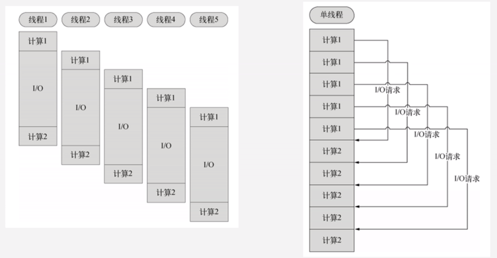

## Node.js介绍
Node.js is a JavaScript runtime built on ***Chrome'sV8 JavaScript engine***. Node.js uses an event-driven, non-blocking I/O model that makes it lightweight and efficent. Node.js'package ecosystem, ***npm***, is the largest ecosystem of open source libraries in the world. 

## nodejs特点
- 单线程  
- 非阻塞I/O
- 事件驱动
<!-- more -->
### 单进程
在Java、PHP或者.net等服务器语言中，会为每一个客户端连接创建一个新的 进程。而每个线程需要耗费大约2MB内存。也就是说理论上，一个8GB内存的服务器可以同时连接的最大用户数为4000个左右。  

Node.js不为每个客户连接创建一个新的线程，而仅仅使用一个内部事件，通过非阻塞I/O、事件驱动机制，让Node.js程序上宏观上也是并行的。使用Node.js，一个8GB内存的服务器，可以同时处理超过4万用户的连接。另外，单线程带来的好处还有，操作系统完全不再有线程创建、销毁的时间开销。  

  

### 非阻塞 I/O
在传统的单线程处理机制中，在执行了访问数据库代码之后，整个线程都将暂停下来，等待数据库返回结果，才能执行后面的代码。也就是说，I/O阻塞了代码的执行，极大地降低了程序的执行效率。  

由于Node.js中采用了非阻塞型I/O机制，因此在执行了访问数据库的代码之后，将立即转而执行其后面的代码，把数据库返回结果的处理代码放在回调函数中，从而提高了程序的执行效率。  

当某个I/O执行完毕时，将以事件形式通知执行I/O操作的线程，线程执行这个事件的回调函数。为了处理异步I/O，线程必须有事件循环，不断的检查有没有未处理的事件，依次予以处理。  

阻塞模式下，一个线程只能处理一项任务，要想提高吞吐量必须通过多线程。而非阻塞模式下，一个线程永远在执行计算操作，这个线程的CPU核心利用率永远是100%。

### 事件驱动
在Node中，客户端请求建立连接，提交数据等行为，会触发响应的事件；在每一个时刻，只能执行一个事件回调函数，但是在执行一个事件回调函数中途，可以转而处理其他事件（比如，新用户连接），然后返回继续执行原事件的回调函数，这种处理机制，称为“事件环”机制。  

Node.js底层是C++（V8也是C++写的）。底层代码中，近半数都用于事件队列、回调函数队列的构建。用事件驱动来完成服务器的任务调度。  

## 适合开发什么？
善于I/O，不善于计算。因为Node.js最擅长的就是任务调度，如果你的业务有很多的CPU计算，实际上也是相当于这个计算阻塞了这个单线程，就不适合Node开发。  

当应用程序需要处理大量并发的I/O，而在向客户端发出响应之前，应用程序内部并不需要进行非常复杂的处理的时候，Node.js非常适合。Node.js也非常适合与websocket配合，开发长连接的实时交互应用。  

比如：
+ 用户表单收集
+ 考试系统
+ 聊天室
+ 图文直播
+ 提供 JSON 的 API （为前台Angular使用）

## 比之老牌后台语言  
Node.js本就是极客追求性能极致的产物，缺少了很多服务器的键状性考量。所以Node不可能应用在银行、证券、电信等需要极高可靠性的业务中。 

中国的企业实战中，创业型公司（正处于A轮、B轮）非常爱使用Node做核心任务：
+ 功夫熊的APP，后台是Node.js在伺服
+ 实现网，整站都为Node.js搭建

成熟大企业，基本上都是用Node实现某一方面的功能：
+ 知乎用了一个Node进程，跑起了“站内信”功能
+ 百度的很多表单，是用Node保存到数据库的